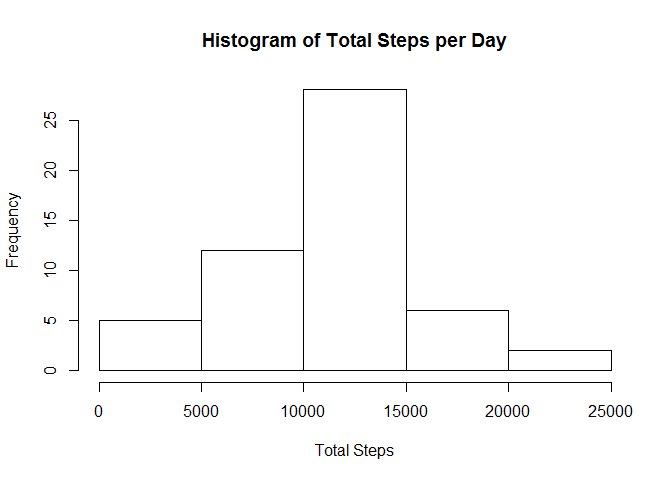
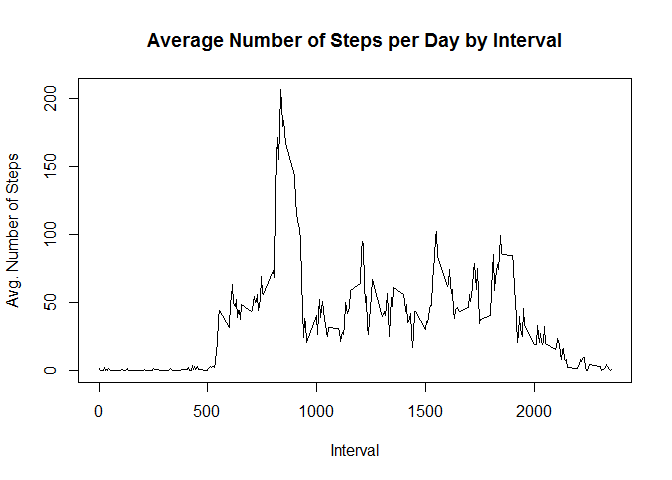
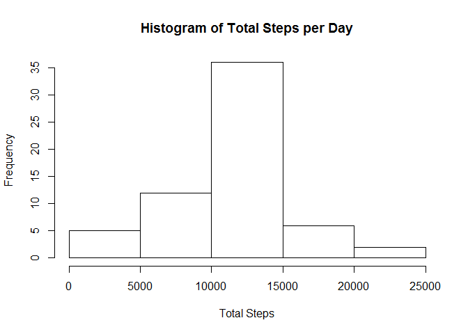
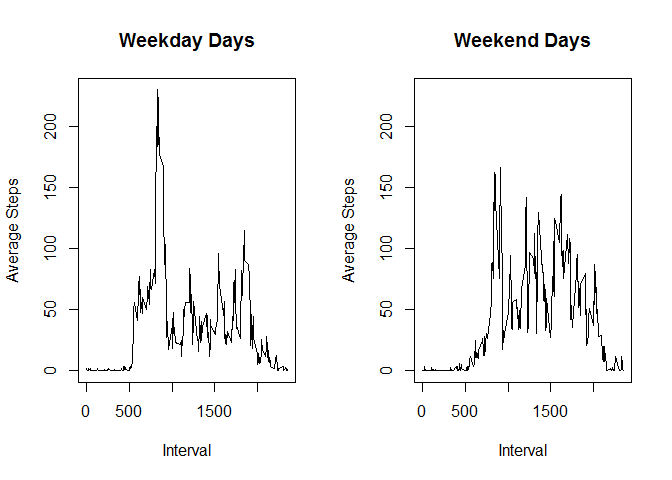

# Reproducible Research: Peer Assessment 1


## Loading and preprocessing the data
Show any code that is needed to

1. Load the data (i.e. \color{red}{\verb|read.csv()|}read.csv())
2. Process/transform the data (if necessary) into a format suitable for your analysis

```r
activity <- read.csv("activity.csv")
```


## What is mean total number of steps taken per day?
For this part of the assignment, you can ignore the missing values in the dataset.

1. Calculate the total number of steps taken per day
2. If you do not understand the difference between a histogram and a barplot, 
   research the difference between them. Make a histogram of the total number of 
   steps taken each day
3. Calculate and report the mean and median of the total number of steps taken per day


```r
steps <- activity[complete.cases(activity), ]
totalSteps <- tapply(X = steps$steps, INDEX = steps$date, FUN = sum)
totalSteps <- totalSteps[complete.cases(totalSteps)]
hist(totalSteps, xlab = "Total Steps", main = "Histogram of Total Steps per Day")
```

<!-- -->

```r
meanSteps <- mean(totalSteps)
medianSteps <- median(totalSteps)
cat(" Mean Steps/Day = ", meanSteps, "\n", "Median Steps/Day = ", medianSteps)
```

```
##  Mean Steps/Day =  10766.19 
##  Median Steps/Day =  10765
```


## What is the average daily activity pattern?
1. Make a time series plot (i.e. type="l") of the 5-minute interval (x-axis) and the 
   average number of steps taken, averaged across all days (y-axis)
2. Which 5-minute interval, on average across all the days in the dataset, contains 
   the maximum number of steps?


```r
steps <- activity[complete.cases(activity), ]
intActiv <- tapply(X = steps$steps, INDEX = steps$interval, FUN = mean)
intActiv <- intActiv[complete.cases(intActiv)]
plot(as.numeric(names(intActiv)), intActiv, type = "l", xlab = "Interval", ylab = "Avg. Number of Steps",
     main = "Average Number of Steps per Day by Interval")
```

<!-- -->

```r
maxInt <- names(intActiv)[which(intActiv == max(intActiv))]
```
The 5-minute interval with the highest average number of steps taken across all day is 835.

## Imputing missing values
Note that there are a number of days/intervals where there are missing values (coded 
as NA). The presence of missing days may introduce bias into some calculations or 
summaries of the data.

1. Calculate and report the total number of missing values in the dataset (i.e. the 
   total number of rows with NAs)
2. Devise a strategy for filling in all of the missing values in the dataset. The 
   strategy does not need to be sophisticated. For example, you could use the 
   mean/median for that day, or the mean for that 5-minute interval, etc.
3. Create a new dataset that is equal to the original dataset but with the missing 
   data filled in.
4. Make a histogram of the total number of steps taken each day and Calculate and 
   report the mean and median total number of steps taken per day. Do these values 
   differ from the estimates from the first part of the assignment? What is the impact 
   of imputing missing data on the estimates of the total daily number of steps?

The strategy I used to fill in the NAs values was to simply replace them with the mean number of steps taken across all days for the corresponding 5-minute interval.


```r
totNA <- sum(!complete.cases(activity))
activityFilled <- activity                  #fill NA step values with the mean number of
for(i in 1:nrow(activityFilled)) {          #steps for the corresponding 5-min interval
  if(is.na(activityFilled$steps[i])) {
    activityFilled$steps[i] <- intActiv[as.character(activityFilled$interval[i])]
  }
}
filledSteps <- tapply(X = activityFilled$steps, INDEX = activityFilled$date, FUN = sum)
hist(filledSteps, xlab = "Total Steps", main = "Histogram of Total Steps per Day")
```

<!-- -->

```r
meanFillSteps <- mean(filledSteps)
medianFillSteps <- median(filledSteps)
cat(" Mean Filled Steps/Day = ", meanFillSteps, "\n", 
    "Median Filled Steps/Day = ", medianFillSteps)
```

```
##  Mean Filled Steps/Day =  10766.19 
##  Median Filled Steps/Day =  10766.19
```

```r
cat(" Mean Steps/Day = ", meanSteps, "\n", 
    "Median Steps/Day = ", medianSteps)
```

```
##  Mean Steps/Day =  10766.19 
##  Median Steps/Day =  10765
```
The total number of NA values was 2304. The mean remained the same while the median changed and is now equal to the mean.


## Are there differences in activity patterns between weekdays and weekends?
For this part the weekdays() function may be of some help here. Use the dataset with 
the filled-in missing values for this part.

1. Create a new factor variable in the dataset with two levels - "weekday" and "weekend" 
   indicating whether a given date is a weekday or weekend day.
2. Make a panel plot containing a time series plot (i.e. type="l") of the 5-minute 
   interval (x-axis) and the average number of steps taken, averaged across all weekday 
   days or weekend days (y-axis). See the README file in the GitHub repository to see an 
   example of what this plot should look like using simulated data.


```r
#convert date column into date objects
activityFilled$date <- as.Date(activityFilled$date)
activityFilled$day.type <- ifelse(is.element(weekdays(activityFilled$date, abbreviate = TRUE), 
                                             c("Sat", "Sun")), "Weekend", "Weekday")
weekdayAct <- activityFilled[activityFilled$day.type == "Weekday", ]
weekendAct <- activityFilled[activityFilled$day.type == "Weekend", ]

weekdayInt <- tapply(X = weekdayAct$steps, INDEX = weekdayAct$interval, FUN = mean)
weekendInt <- tapply(X = weekendAct$steps, INDEX = weekendAct$interval, FUN = mean)

rng <- c(0, max(weekdayInt, weekendInt))

par(mfrow = c(1,2))
plot(as.numeric(names(weekdayInt)), weekdayInt, type = "l", 
     xlab = "Interval", ylab = "Average Steps", main = "Weekday Days",
     ylim = rng)
plot(as.numeric(names(weekendInt)), weekendInt, type = "l", 
     xlab = "Interval", ylab = "Average Steps", main = "Weekend Days",
     ylim = rng)
```

<!-- -->
  
It appears that while weekdays tend to have a higher peak, the weekend days show more activity overall.
